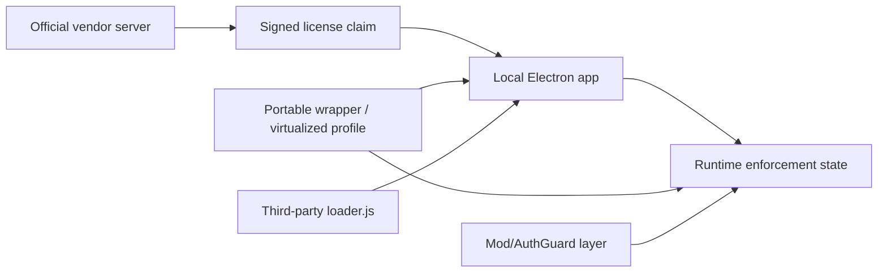

# 02 - Wrapper And Tamper Indicators

## Executive Finding

`fact`: The portable sample includes Turbo/Xenocode-style virtualization artifacts, duplicated Electron resource trees, a changed `package.json` entrypoint, third-party loader/gatekeeper/injector scripts, and a bundled virtualized user profile.

`inference`: The observed package changes move the trust boundary. Instead of Plasticity launching directly from the official Electron entrypoint, execution is mediated by a third-party loader inside a virtualized environment.

`risk`: For a licensing system, this is a high-value architectural bypass surface because runtime state, local profile artifacts, app resources, and renderer behavior can be replayed or mediated before official license enforcement code observes the environment.

## Indicator: Turbo/Xenocode Virtualization

`fact`: The sample contains:

- `Plasticity\local\stubexe\...` shim executables.
- Virtual path roots such as `@APPDATA@`, `@APPDATALOCAL@`, `@PROGRAMFILES@`.
- `__Xenocode` artifacts.
- `README.txt` references Turbo registry and Temp artifacts.
- `DeleteTurbo.bat` references `HKEY_CURRENT_USER\Software\TURBO` and a Temp `TURBO` folder.

`inference`: The app is packaged to run inside a virtualized filesystem/registry envelope that can carry its own AppData and runtime state.

`risk`: Local license enforcement that trusts local AppData, local storage, cached license state, or machine-local files can be replayed as part of the portable container.

`control`: Treat profile state as untrusted input. Bind offline freshness to signed server time, signed machine activation state, monotonic local counters protected by platform keystores, and server-side anomaly detection rather than raw local files.

## Indicator: Electron Entrypoint Redirection

`fact`: Clean 26.1.3 uses `main: ".webpack/main"`.

`fact`: Portable resource trees use `main: "loader.js"` and `name: "plasticity-pcmc"`.

`fact`: `loader.js`, `injector.js`, and `gatekeeper.js` are present in five duplicated resource locations.

| File | Count | Size | SHA-256 |
| --- | ---: | ---: | --- |
| `loader.js` | 5 | 19,756 | `A493E0F4301AC2C4C633EF5A1E2192D60BB578833BAA2051AB882BDBA5AF7295` |
| `injector.js` | 5 | 27,711 | `4ED3D1A5CAA59642A5491887E7B2EC69B5AF7103DFA86C26394C55B9138B8937` |
| `gatekeeper.js` | 5 | 9,251 | `6788AFC6FAE72A7AC0D7087B3021461915C4B31907F52646275D93913922E5E7` |

`inference`: The startup path is mediated by third-party JavaScript before or around the official application bundle.

`risk`: A loader-controlled startup path can alter IPC wiring, preload behavior, module resolution, renderer injection, local state, feature gating, or telemetry before the official licensing code reaches an enforcement decision.

`control`: Ship a signed resource manifest covering `package.json`, Electron entrypoint, `.webpack` assets, preload scripts, native modules, and critical static assets. Validate the manifest in a native bootstrap before JavaScript execution reaches app logic.

## Indicator: Mod/AuthGuard Layer

`fact`: `AuthGuard.js` is present twice:

| Count | Size | SHA-256 |
| ---: | ---: | --- |
| 2 | 72,623 | `4FE627CDFAEC18B09FBC5159F39779699ADD3A9A8543F53CBD29A8DB1D3FF62C` |

`fact`: The package includes `Community_mods_collection`, `Mods_2_1_0`, and `manifest.json` identifying `PCMC Team` with `core` and `mods` version `2.1.0`.

`inference`: The portable package includes a mod framework that may participate in UI/runtime injection, state shaping, or command exposure.

`risk`: If trial/paid/Studio boundaries are enforced mostly in renderer UI state, a mod framework can become an entitlement-confusion surface even without forging a cryptographic license.

`control`: Enforce entitlements at command dispatch and native operation boundaries. UI state may hide or show controls, but actual privileged actions should query a verified authorization object, not a mutable renderer flag.

## Indicator: Non-Publisher Executable Boundary

`fact`: Several shim executables under `Plasticity\local\stubexe\...` are signed by `Code Systems Corporation`, not by Plastic Software.

`fact`: The outer `Plasticity_25.2.8.exe` is not Authenticode-signed.

`fact`: The virtualized `@PROGRAMFILES@\Plasticity\Plasticity.exe` is not Authenticode-signed.

`inference`: Execution enters through a packaging/runtime boundary not controlled by the original publisher signature chain.

`risk`: Publisher signing of the original application is not sufficient if users can be induced to run a portable wrapper that carries copied or modified resources and profile state.

`control`: Add in-product self-measurement and server-side attestation signals that distinguish official install channels from virtualized wrappers. Avoid hard fail solely on heuristic wrapper detection; use it as a risk signal combined with resource manifest verification and activation policy.

## Trust Boundary Impact

`inference`: Ed25519 protects license authenticity, but this sample class targets the transition from a verified claim to local runtime enforcement state. The cryptographic boundary and the execution boundary are different.

`control`: Vendor should treat `verified signed claim -> authorized command execution` as the critical boundary, with integrity checks around code, runtime context, and command-level entitlement evaluation.

