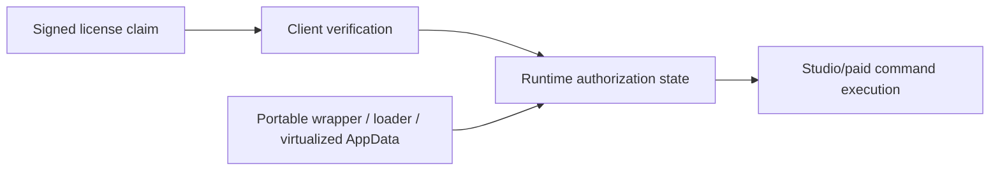

# 07 - Vendor Evidence Strategy

## Goal

`fact`: The vendor is expected to require proof of impact, not only architectural claims.

`control`: Provide evidence in layers, from passive artifact facts to vendor-run validation tests. Avoid publishing memory addresses, patch recipes, hidden command invocation steps, API emulation, or exploit payloads.

## Evidence Ladder

### Level 1 - Passive Artifact Evidence

`fact`: The portable sample changes Electron startup metadata from the official-style `main: ".webpack/main"` model to `main: "loader.js"` in multiple resource trees.

`fact`: The sample includes repeated `loader.js`, `injector.js`, `gatekeeper.js`, and `AuthGuard.js` artifacts.

`fact`: The sample includes Turbo/Xenocode virtualization indicators, bundled AppData/profile state, and wrapper shim executables.

`fact`: Bundled logs contain 108 occurrences of `RENDER: License validity: true` between `2025-11-28` and `2026-06-28`.

`impact`: This proves a real-world piracy/convenience build is targeting local runtime mediation and profile portability, not Ed25519 forgery.

### Level 2 - Trust Boundary Proof

`risk`: The cryptographic license claim and the runtime authorization state are different trust objects.

`evidence`: Show the vendor the boundary:

`impact`: If `C` can be mediated locally, the attacker does not need to forge `A`.

### Level 3 - Vendor-Run Instrumented Build

`control`: Ask the vendor to produce an internal diagnostic build with structured license-state telemetry. This should not expose secrets and should not be distributed publicly.

Required logs:

- license source: online, offline cache, trial, expired, error;
- state transition: previous state -> next state;
- signed claim hash or opaque claim ID;
- activation ID, not raw PII;
- fingerprint version, not raw fingerprint values;
- command ID;
- entitlement decision source;
- final command allow/deny result;
- process boundary: main, renderer, native command dispatcher.

`evidence`: Run negative entitlement tests and provide logs proving whether restricted commands are denied at the dispatcher/native boundary.

### Level 4 - Safe Impact Test Matrix

`control`: The vendor should test these states using internal licenses and internal builds:

| Test Case | Expected Secure Result |
| --- | --- |
| Trial state attempts Studio command | denied at command/native boundary |
| Expired business entitlement attempts Studio command | denied as `BUSINESS_EXPIRED` |
| Offline cache stale attempts paid command | denied or grace-limited as policy requires |
| Renderer sends forged/optimistic entitlement state | denied because renderer is not authority |
| IPC payload omits verified context | denied fail-closed |
| Resource manifest invalid or entrypoint changed | privileged licensing/commands disabled |
| Clock moves backward beyond tolerance | refresh required before paid commands |
| Same cached profile appears on different machine context | online revalidation required |

`impact`: This gives Nick a direct, bounded way to verify the claim without reverse engineering the pirate package himself.

### Level 5 - Memory-Tamper Class Validation

`risk`: Cheat Engine-like tooling is relevant only as a class of attack against mutable client-side state.

`control`: Do not provide fixed addresses or patch tables. Instead, ask the vendor to validate the invariant:

> No paid or Studio command may be authorized solely because a mutable renderer/main-process boolean says it is allowed.

Suggested vendor-only validation:

- intentionally corrupt non-authoritative UI/view-model state in a debug build;
- send inconsistent internal test IPC messages from a test harness;
- flip test-only canary variables that mirror UI entitlement state;
- verify paid commands still deny unless `VerifiedLicenseContext` contains the required signed entitlement.

`impact`: If commands still execute after non-authoritative state is corrupted, the issue is High severity. If commands deny at dispatcher/native boundary, the Cheat Engine-style risk is largely reduced to UI tampering/DoS.

## Report Framing For A Strict Vendor

Recommended wording:

`risk`: "The observed portable build demonstrates that real-world abuse targets local runtime enforcement and profile portability. The evidence does not claim Ed25519 forgery. It shows that the security boundary after signature verification must be hardened because attackers can mediate Electron startup, renderer state, profile storage, and command exposure."

`impact`: "If Studio/paid entitlements are enforced through mutable client-side state or renderer-visible flags, a third-party loader or memory-tampering tool can potentially enable restricted workflows without a valid Studio authorization claim. This is especially serious because trial and paid tiers share the same binary code paths."

`control`: "Vendor should validate entitlement decisions at command/native boundaries using immutable verified claims and signed freshness, with resource-integrity verification before JavaScript startup."

## What Not To Include

Do not include:

- byte-level patch locations;
- memory addresses;
- pointer chains;
- Cheat Engine tables;
- hidden command invocation recipes;
- API emulation instructions;
- source excerpts from third-party bypass scripts;
- step-by-step portable build execution instructions.

## Best Ask To Vendor

`control`: Ask for permission to submit the passive artifact package plus this bounded validation plan. The key request is not "please reverse this crack", but:

> Please run the attached negative entitlement matrix on an instrumented internal build and confirm whether command execution depends on immutable verified claims or mutable client-side state.

